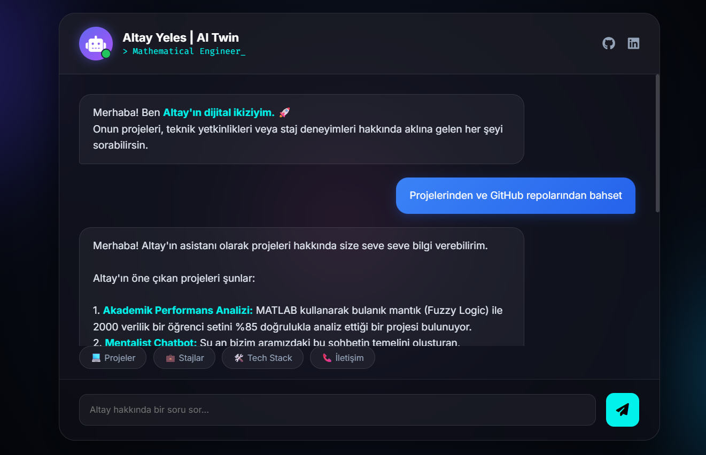

# 🤖 Altay Yeles | AI Digital Twin


This repository hosts my **Personal AI Assistant**, a "Digital Twin" designed to interact with recruiters and developers. Instead of a static CV, users can chat with this AI to learn about my projects, internships (Bluesense AI, TNC Group), and technical skills.

It leverages **Google's Gemini 2.5 Flash** model for high-speed, intelligent responses and uses a **serverless architecture** for security and scalability.

🔗 **Live Demo:** [Click here to chat with Altay AI](https://altayyeles.github.io/altay-ai/)

---

## 📸 Interface


*(Note: Provide a screenshot of your chat interface here)*

## 🚀 Key Features

* **⚡ Gemini 2.5 Flash Integration:** Powered by Google's latest generative AI model for accurate and context-aware responses.
* **🔒 Secure Serverless Backend:** Built with **Cloudflare Workers** to act as a proxy, keeping the API keys hidden and secure (no exposed keys on the frontend).
* **🎨 Glassmorphism Design:** A modern, responsive UI with CSS glass effects, animated backgrounds, and mobile compatibility.
* **🧠 Custom Knowledge Base:** Fine-tuned with a system prompt containing my real-world experience, academic background (Mathematical Engineering), and GitHub repositories.
* **💡 Smart Suggestions:** Quick-action chips for common queries like "Projects", "Tech Stack", and "Contact".

## 🛠️ Tech Stack

| Component | Technology | Description |
| :--- | :--- | :--- |
| **AI Model** | Google Gemini 2.5 Flash | The "Brain" processing natural language queries. |
| **Backend** | Cloudflare Workers | Serverless proxy to handle API requests securely. |
| **Frontend** | HTML5, CSS3, JavaScript | Vanilla JS for lightweight performance. |
| **Hosting** | GitHub Pages | Static hosting for the interface. |

## 🏗️ Architecture

```mermaid
graph LR
    A[User] -- Message --> B(GitHub Pages Frontend)
    B -- Secure POST Request --> C{Cloudflare Worker}
    C -- System Prompt + User Msg --> D[Google Gemini API]
    D -- AI Response --> C
    C -- JSON Reply --> B
    B -- Display Message --> A
