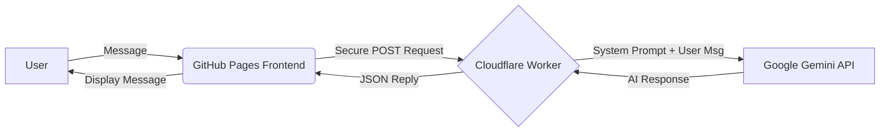

# 🤖 Altay Yeles | AI Digital Twin


This repository hosts my **Personal AI Assistant**, a "Digital Twin" designed to interact with recruiters and developers. Instead of a static CV, users can chat with this AI to learn about my projects, internships (Bluesense AI, TNC Group), and technical skills.

It leverages **Google's Gemini 2.5 Flash** model for high-speed, intelligent responses and uses a **serverless architecture** for security and scalability.

🔗 **Live Demo:** [Click here to chat with Altay AI](https://altayyeles.github.io/altay-ai/)

---

## 📸 Interface


*(Note: Provide a screenshot of your chat interface here)*

## 🚀 Key Features

* **⚡ Gemini 2.5 Flash Integration:** Powered by Google's latest generative AI model for accurate and context-aware responses.
* **🔒 Secure Serverless Backend:** Built with **Cloudflare Workers** to act as a proxy, keeping the API keys hidden and secure (no exposed keys on the frontend).
* **🎨 Glassmorphism Design:** A modern, responsive UI with CSS glass effects, animated backgrounds, and mobile compatibility.
* **🧠 Custom Knowledge Base:** Fine-tuned with a system prompt containing my real-world experience, academic background (Mathematical Engineering), and GitHub repositories.
* **💡 Smart Suggestions:** Quick-action chips for common queries like "Projects", "Tech Stack", and "Contact".

## 🛠️ Tech Stack

| Component | Technology | Description |
| :--- | :--- | :--- |
| **AI Model** | Google Gemini 2.5 Flash | The "Brain" processing natural language queries. |
| **Backend** | Cloudflare Workers | Serverless proxy to handle API requests securely. |
| **Frontend** | HTML5, CSS3, JavaScript | Vanilla JS for lightweight performance. |
| **Hosting** | GitHub Pages | Static hosting for the interface. |

## 🏗️ Architecture


🔧 How It Works
 1. The Prompt: The AI is initialized with a specific "System Instruction" that defines its persona as my assistant. It holds data about my repos (e.g., Andrew Ng's ML Course, Microsoft Python modules).

 2. The Request: When a user types a message, it's sent to the Cloudflare Worker.

3. The Security: The Worker injects the GEMINI_API_KEY (stored as an environment secret) and forwards the request to Google.

4. The Response: The AI generates a response based on the context and returns it to the frontend.

📦 Local Setup
If you want to clone and run this project:

1. Clone the repo:
 git clone [https://github.com/altayyeles/altay-ai.git](https://github.com/altayyeles/altay-ai.git)
2. Open index.html: You can run it directly in your browser or use a live server.
3. Backend Setup: You will need your own Cloudflare Worker script and Google Gemini API Key to make it functional.

📬 Contact:
Developer: Altay Yeles
Email: altay.yeles@std.yildiz.edu.tr
LinkedIn: Altay Yeles

Built with ❤️ and ☕ by a Mathematical Engineer.

-----

````markdown
# 🤖 Altay Yeles | AI Digital Twin


This repository hosts my **Personal AI Assistant**, a "Digital Twin" designed to interact with recruiters and developers. Instead of a static CV, users can chat with this AI to learn about my projects, internships (Bluesense AI, TNC Group), and technical skills.

It leverages **Google's Gemini 2.5 Flash** model for high-speed, intelligent responses and uses a **serverless architecture** for security and scalability.

🔗 **Live Demo:** [Click here to chat with Altay AI](https://altayyeles.github.io/altay-ai/)

---

## 📸 Interface


*(Note: Provide a screenshot of your chat interface here)*

## 🚀 Key Features

* **⚡ Gemini 2.5 Flash Integration:** Powered by Google's latest generative AI model for accurate and context-aware responses.
* **🔒 Secure Serverless Backend:** Built with **Cloudflare Workers** to act as a proxy, keeping the API keys hidden and secure (no exposed keys on the frontend).
* **🎨 Glassmorphism Design:** A modern, responsive UI with CSS glass effects, animated backgrounds, and mobile compatibility.
* **🧠 Custom Knowledge Base:** Fine-tuned with a system prompt containing my real-world experience, academic background (Mathematical Engineering), and GitHub repositories.
* **💡 Smart Suggestions:** Quick-action chips for common queries like "Projects", "Tech Stack", and "Contact".

## 🛠️ Tech Stack

| Component | Technology | Description |
| :--- | :--- | :--- |
| **AI Model** | Google Gemini 2.5 Flash | The "Brain" processing natural language queries. |
| **Backend** | Cloudflare Workers | Serverless proxy to handle API requests securely. |
| **Frontend** | HTML5, CSS3, JavaScript | Vanilla JS for lightweight performance. |
| **Hosting** | GitHub Pages | Static hosting for the interface. |

## 🏗️ Architecture

```mermaid
graph LR
    A[User] -- Message --> B(GitHub Pages Frontend)
    B -- Secure POST Request --> C{Cloudflare Worker}
    C -- System Prompt + User Msg --> D[Google Gemini API]
    D -- AI Response --> C
    C -- JSON Reply --> B
    B -- Display Message --> A
````

## 🔧 How It Works

1.  **The Prompt:** The AI is initialized with a specific "System Instruction" that defines its persona as my assistant. It holds data about my repos (e.g., Andrew Ng's ML Course, Microsoft Python modules).
2.  **The Request:** When a user types a message, it's sent to the Cloudflare Worker.
3.  **The Security:** The Worker injects the `GEMINI_API_KEY` (stored as an environment secret) and forwards the request to Google.
4.  **The Response:** The AI generates a response based on the context and returns it to the frontend.

## 📦 Local Setup

If you want to clone and run this project:

1.  **Clone the repo:**
    ```bash
    git clone [https://github.com/altayyeles/altay-ai.git](https://github.com/altayyeles/altay-ai.git)
    ```
2.  **Open `index.html`:** You can run it directly in your browser or use a live server.
3.  **Backend Setup:** You will need your own Cloudflare Worker script and Google Gemini API Key to make it functional.

## 📬 Contact

  * **Developer:** Altay Yeles
  * **Email:** altay.yeles@std.yildiz.edu.tr
  * **LinkedIn:** [Altay Yeles](https://www.google.com/search?q=https://linkedin.com/in/altayyeles)

-----

*Built with ❤️ and ☕ by a Mathematical Engineer.*

